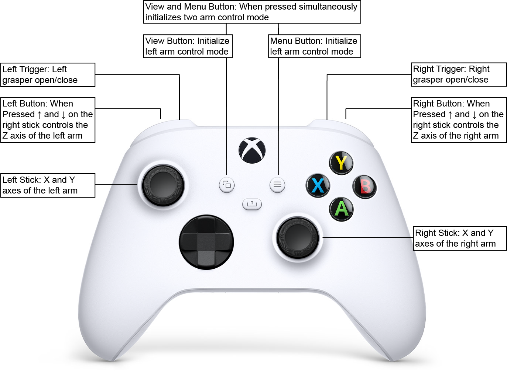
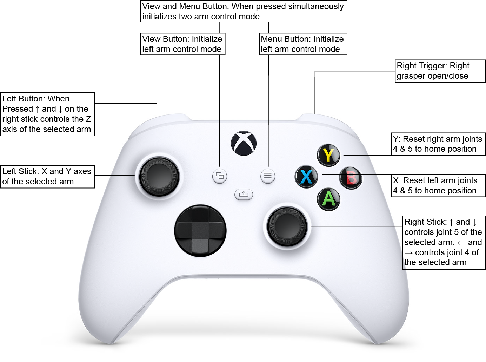

# Python Controller for Raven II
Author: Natalie Chalfant (chalf22n@mtholyoke.edu)

AMBF Raven controller is a Python client that controls the simulated Raven II surgical robot in AMBF. 
It consists of 5 different modes: homing, sine dance, file mode, and manual mode. Joint level control 
is possible using the file mode while manual allows cartesian control in realtime using an Xbox controller.

This controller is designed to work with both first party and third party XBox controllers. Depending on which
controller type you are using the global DEADZONE variable (found at the beginning of ambf_raven_controller.py) 
may need to be modified to prevent drift or provide the most responsive control. If you experience drift (raven
continuing to move even when there is no input) increase the DEADZONE variable until it stops.

## Homing
Accessed by pressing the h key when prompted to select a mode. This mode returns the simulated Raven II
to its home position.

## Since Dance
This mode has the simulated Raven II follow a pre-planned trajectory which moves all joints following 
the sine function.

## File Mode
Reads joint positions from a csv file and has the simulated Raven II follow move through the 
defined positions. This was designed to take the recorded trajectories from a physical Raven II and 
enable the simulated Raven II to mimic them. 

## Manual Mode
Enable realtime control of the Simulated Raven II using an xbox controller. This mode implements both
standard Raven II kinematics as well as modified kinematics designed for simpler more intuitive operation
using the limited inputs on an Xbox controller. There are two control modes: two arm mode, and one arm mode.
Manual mode was designed to allow Raven II to manipulate objects in its environment in realtime including 
both rigid and soft bodies.

The two arms mode allows limited control of both arms simultaneously. By default it uses the modified 
kinematics which lock joints 4,5, and 6 to their home position. This results in grasper being locked in 
line with the tool shaft creating a tool which is more intuitive to move using the limited controls. 
This mode uses the following control scheme.

The one arm control adds joint level control of joints 4 and 5. The positions of joints 4 and 5 will be
maintained when switching back to the two arm mode and can be reset at any time using the mapped buttons.
This mode uses the following control scheme.

